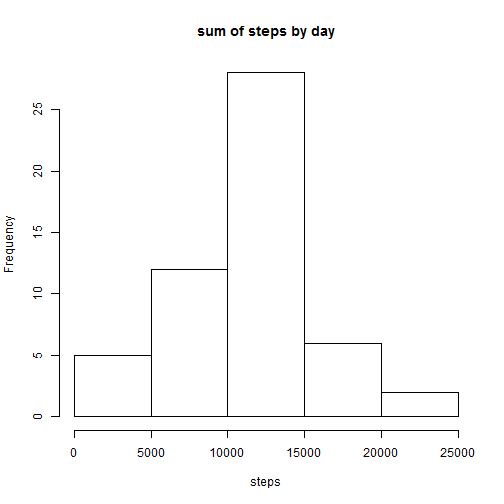
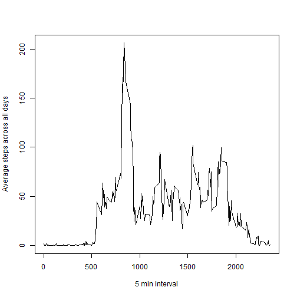
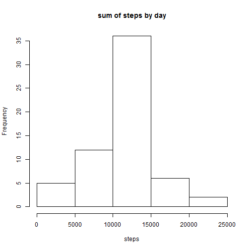
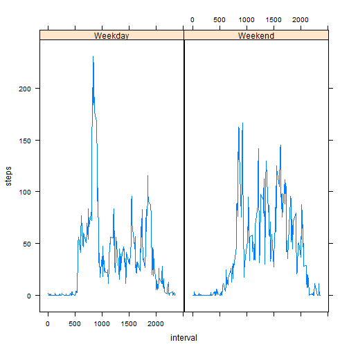

Reproducible Research Peer Assessment 1
========================================================

First load data.


```r
data=read.csv("activity.csv")
```

## What is mean total number of steps taken per day?

To plot a histogram first aggregate the total number of steps taken in a day. Then plot.  


```r
Total = aggregate(steps ~ date, data = data, sum, na.rm = TRUE)
hist(Total$steps, main = "sum of steps by day", xlab = "steps")
```

 

The mean and median are


```r
mean(Total$steps)
```

```
## [1] 10766.19
```

```r
median(Total$steps)
```

```
## [1] 10765
```

## What is the average daily activity pattern?

To get the mean of steps per interval


```r
times = tapply(data$steps, data$interval, mean, na.rm = TRUE)
```
Time series plot of the above


```r
plot(row.names(times), times, type = "l", xlab = "5 min interval", 
    ylab = "Average steps across all days")
```

 

The 5 min interval with max average number of steps is


```r
names(which.max(times))
```

```
## [1] "835"
```

## Imputing missing values

the total number of missing values in the dataset


```r
sum(is.na(data))
```

```
## [1] 2304
```

Devise a strategy for filling in all of the missing values in the dataset. The strategy does not need to be sophisticated. For example, you could use the mean/median for that day, or the mean for that 5-minute interval, etc


```r
meansteps = aggregate(steps ~ interval,data=data,FUN=mean)
hello=numeric()
for (i in 1:nrow(data)) {
  if (is.na(data[i, ]$steps)) {
    steps=steps=subset(meansteps,interval==data[i, ]$interval)$steps
  }else {
        steps=data[i,]$steps
    }
    hello= c(hello, steps)
}
```

Fill in new data which is like original but with NA filled in


```r
data2=data
data2$steps=hello
```

Make a histogram of the total number of steps taken each day and Calculate and report the mean and median total number of steps taken per day. Do these values differ from the estimates from the first part of the assignment? What is the impact of imputing missing data on the estimates of the total daily number of steps?

To plot a histogram first aggregate the total number of steps taken in a day. Then plot.


```r
Total = aggregate(steps ~ date, data = data2, sum, na.rm = TRUE)
hist(Total$steps, main = "sum of steps by day", xlab = "steps")
```

 
The mean and median are


```r
mean(Total$steps)
```

```
## [1] 10766.19
```

```r
median(Total$steps)
```

```
## [1] 10766.19
```

## Are there differences in activity patterns between weekdays and weekends?


```r
day = weekdays(as.Date(data2$date))
weektype=vector()
for (i in 1:nrow(data2)) {
    if (day[i] == "Saturday") {
        weektype[i]="Weekend"
    } else if (day[i] == "Sunday") {
        weektype[i]="Weekend"
    } else {
        weektype[i]="Weekday"
    }
}
data2$weektype=factor(weektype)
```

Make a panel plot containing a time series plot (i.e. type = "l") of the 5-minute interval (x-axis) and the average number of steps taken, averaged across all weekday days or weekend days (y-axis). See the README file in the GitHub repository to see an example of what this plot should look like using simulated data.


```r
meansteps=aggregate(steps ~ interval + weektype, data = data2, mean)
names(meansteps)=c("interval", "weektype", "steps")
library("lattice")
xyplot(steps ~ interval | weektype, meansteps, layout = c(2, 1), type = "l", xlab = "interval", ylab = "steps")
```

 
